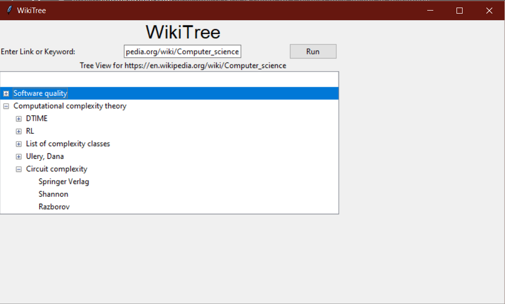

<h1 align ="center">WikiTree readme </h1>

## Description
This application takes in a Wikipedia link and builds up a hierarchical tree. It scrapes all the links of the Wikipedia page and selects random ones, then for every link added to the tree, it will scrape the links of that page and add them to the tree as children of the previous link. It repeats this processive repeteadly implementing a double ended queue to end up with a balanced tree showing the relations of all links.

## Example
 Link : https://en.wikipedia.org/wiki/Computer_science

Output: 

## To Do
 
 Only basic functionality has been implemeted. Currently, you can build only one tree, if you want to rerun with a different link you have to close the app and reruun. Instead, I could add functionality so that when the run button is clicked and a tree is already displayed, the program could clear the contents of the tree and build a new tree with the new link. I would also like to add the functionality to double click a current title of the tree and build a new tree with the root being the double clicked title.

 ## Contributions

 For anyone looking to contribute to this project:

 Currently the program takes relatively long to build the tree because it has to scrape all the links of the Wikipedia page and then select a few random ones. Ideas would be appreciated to find an efficient way to get a few random links without having to look at all the links in the page. 

 